# Hermes Collab Engine v5.5

[](CHANGELOG.md) [](sandbox/README.md) [](#许可证) [](SECURITY.md)

Hermes Collab Engine v5.5 是面向 **Hermes 协同引擎** 的首个正式公开发布版 **AI multi-agent collaboration engine**：Leader 把需求拆成 WBS，Worker 并行执行，Claude Code / Hermes Agent / 自定义 Agent Backend 可接入同一条协作流水线。

它同时提供实时 **dashboard**、隔离 **sandbox**、Leader 反馈日记本、轻量 API 与一行安装部署，适合把复杂研发任务拆解、调度、审计并汇总成可读交付物。




## 发布与社区

如果这个项目对你有帮助，欢迎在 GitHub star 关注 v5.0 发布线。参与前请阅读 [`CONTRIBUTING.md`](CONTRIBUTING.md)，安全问题请走 [`SECURITY.md`](SECURITY.md)，路线图见 [`ROADMAP.md`](ROADMAP.md)，版本变化见 [`CHANGELOG.md`](CHANGELOG.md)。社区分享文案可参考 [`docs/launch/v5.0-posts.md`](docs/launch/v5.0-posts.md)。

## 一行部署

```bash
curl -fsSL https://raw.githubusercontent.com/lpc0387/hermes-collab-engine/main/scripts/install.sh | bash
```

安装脚本会检查依赖、克隆/更新仓库、创建本地虚拟环境，并创建空模板目录；仓库**不捆绑任何运行时数据、密钥、真实 Hermes/Claude 配置**。如需把 Hermes 接入本地协同引擎，请先审阅模板脚本：

```bash
cd ~/hermes-collab-engine
./scripts/install-hermes-integration.sh --dry-run
```

## 快速开始

```bash
# 启动选择器：选配置 → 选 Leader/Worker 模型 → 面板 + Hermes CLI
opc

# 手动安装方式
python3 -m pip install -e .

# 直接运行任务
hermes-collab run "分析当前项目结构" --cwd . --json
```

## 亮点

| 能力 | 发布说明 |
|---|---|
| WBS 协同 | Leader 评分、拆解、分发节点，Worker 按依赖并行执行 |
| Leader/Worker 双模型 | 启动时分别选择 Leader 模型与 Worker 模型，面板显示当前模型 |
| 真实沙盒执行 | `scripts/start_sandbox.sh --real` 可在受限额度内启动真实 worker；默认模式仍为 mock 演示 |
| 隔离 DB / workspace | 沙盒使用演示 SQLite；真实执行写入 `data/sandbox_real.sqlite3` 与独立 workspace，不读写生产库 |
| TTL 清理 | 沙盒默认 2 小时，到期自动停止，避免演示进程长期驻留 |
| 轻量 API payload | 面板 API 返回运行、节点、Worker、日志等必要字段，便于嵌入和代理转发 |
| Leader 反馈日记本 | 任务完成后弹出像素本子，完整展示 Leader 聚合反馈，支持复制/下载 Markdown |
| 一行 curl 部署 | 使用上方 `curl ... | bash` 即可安装，模板脚本再按需接入 Hermes |

## v5.5 预览版新增

> v5.5 是面向开发者的预览版，新增以下功能，欢迎试用反馈。

### 统一注册表 (UnifiedRegistry)
- Skill、Tool、MCP 统一管理，能力标签索引
- Web UI 注册 → 自动持久化，重启不丢失
- Leader 自动感知可用 skill/tool 并在 WBS 阶段预分配

### Agent 管理
- 内置 Agent（claude-code、hermes、codex、opencode）
- Web UI 注册自定义 Agent，严格验证（name/command/capabilities）
- 启用状态显示，能力标签

### 会话链
- 通过"接入上次会话"形成连续对话链
- 按 resume 链分组展示多个 run 的状态与进度
- 无连续对话时面板自动隐藏

### Lessons 自学习系统
- 引擎自动记录运行经验并去重提炼（run_id 归一化）
- 只读节点风险检测修复（不再误触发 checkpoint）
- checkpoint 状态原子持久化
- lessons_learned 字段自动输出到 run 结果

### Skill/MCP 工具注入
- Leader 在 WBS 阶段为每个节点预分配 skill 和 MCP 工具
- Web UI 支持文件导入注册（.md/.txt for skill，.json for MCP）
- 工具白名单（permission whitelist）不受原生能力过滤影响

### 沙盒一键启动
```bash
sandbox              # 默认 2 小时，端口 8876
sandbox 4            # 运行 4 小时
sandbox --port 8877  # 自定义端口
```
沙盒与生产完全隔离（独立 DB、工作区、端口），同步了全部 v5.5 Web UI 功能。

## 沙盒演示

沙盒用于演示 dashboard、运行历史、Worker 状态、模型展示与 Leader 日记本。它使用 mock API 和脱敏演示数据，**不调用真实 worker、不写生产数据、不包含真实运行时数据**。

如需在线体验沙盒环境，可以通过 WeChat：`lg19961117` 联系作者开放体验入口。

```bash
# 一键启动（默认运行 2 小时，超时自动停止）
./scripts/start_sandbox.sh

# 自定义运行小时数
./scripts/start_sandbox.sh 4              # 4 小时
./scripts/start_sandbox.sh 0.5            # 30 分钟
./scripts/start_sandbox.sh --hours 8      # 8 小时
./scripts/start_sandbox.sh --port 8877    # 换端口
./scripts/start_sandbox.sh -i             # 交互式询问时长

# 复用已有数据库，不重新播种；或在隔离 DB/workspace 中试跑真实 worker
./scripts/start_sandbox.sh --no-reseed
./scripts/start_sandbox.sh --real
```

启动后访问：`http://127.0.0.1:8876/`。详见 [`sandbox/README.md`](sandbox/README.md)。

v5.5 新增 `sandbox` 一键启动命令，与 `opc` 同级：

```bash
sandbox              # 默认 2 小时，端口 8876
sandbox 4            # 运行 4 小时
sandbox --port 8877  # 自定义端口
sandbox --real       # 启用真实 worker 执行
```

## 核心概念

```text
用户 → Leader(AI) → WBS 拆解 → Worker(AI) × N 并行 → 聚合 → 结果
```

- **Leader**：复杂度评分、WBS 拆解、结果聚合、Skill/Tool 分发。
- **Worker**：执行具体节点，按需加载 Skill 和工具白名单。
- **Agent Backend**：抽象 Claude Code / Codex / OpenCode / 自定义编码 Agent。
- **SQLite**：持久化运行状态、节点结果、上下文快照和经验。
- **Dashboard**：实时展示流水线、Worker 池、Skill/Tool 注入、模型和日志。

## CLI 命令

### 运行任务

```bash
hermes-collab run "分析当前项目结构" --cwd . --json
hermes-collab run --request-file request.md --cwd .
hermes-collab run "实现协同任务" --agent claude-code --concurrency 4 --timeout 900
```

### 启动面板

```bash
hermes-collab server --host 0.0.0.0 --port 8765 --cwd .
```

### 查看 Skill / Tool

```bash
hermes-collab skills                                # 全部技能
hermes-collab skills --node-type implementation      # 预览选中技能
hermes-collab tools                                 # 全部工具配置
hermes-collab tools --node-type implementation       # 预览选中工具
```

### 查看 Agent / 状态

```bash
hermes-collab agents                # 已注册 backend
hermes-collab agents --available    # PATH 上可用的
hermes-collab status --json
```

### 经验管理

```bash
hermes-collab lessons                       # 列出经验
hermes-collab lessons --scope global        # 按作用域筛选
hermes-collab add-lesson --category timeout --lesson "拆分大文件" --scope global
```

### 运行中干预

```bash
hermes-collab kill-node <run_id> <node_id>  # 终止节点
hermes-collab split-node <run_id> <node_id> # 拆分节点
hermes-collab skip-node <run_id> <node_id>  # 跳过节点
hermes-collab redo-node <run_id> <node_id>  # 重做节点
hermes-collab log <run_id> <node_id> "msg"  # 写入日志
```

### 验证

```bash
hermes-collab verify-release # v5.0 发布完整性检查
```

## API

| 方法 | 路径 | 说明 |
|---|---|---|
| GET | `/api/overview` | 总览数据 |
| GET | `/api/runs` | 运行记录 |
| GET | `/api/runs/:id` | 轻量运行详情（节点与最近日志，适合 dashboard 快速刷新） |
| GET | `/api/runs/:id?full=1` | 完整运行详情（含 Worker、完整日志、模型与 Leader 反馈） |
| GET | `/api/logs` | 最近日志 |
| GET | `/api/lessons` | 自学习经验 |
| GET | `/api/agents` | 可用 Agent Backend |
| GET | `/api/skills?node_type=&task=` | Skill 注册表（可预览选择） |
| GET | `/api/tools?node_type=&task=` | Tool 配置（可预览选择） |
| GET | `/api/events` | SSE 实时事件流 |
| POST | `/api/runs` | 异步提交任务 |

## 配置来源

启动器按以下优先级自动检测 API 配置：

1. **`~/.hermes/.env`** — `ANTHROPIC_API_KEY` + `ANTHROPIC_BASE_URL`（推荐）
2. **`~/.hermes/config.yaml`** — `model.base_url` + `model.default`
3. **`~/.hermes/auth.json`** — credential pool 中的 anthropic 凭据
4. **`~/.claude/settings.json`** — Claude Code 配置（fallback）
5. **手动输入** — BaseURL + API Key + 模型列表

Hermes 是 Leader，其配置应为主来源。Claude Code 配置仅作兼容回退。仓库只提供空模板和 `.example` 文件，不读取、不复制、不发布真实 Hermes/Claude secrets、token、session、auth、log 或 sqlite 数据。

环境变量：

```bash
HERMES_COLLAB_MODEL=glm-5.1           # 全局模型
HERMES_COLLAB_LEADER_MODEL=glm-5.1    # Leader 模型
HERMES_COLLAB_WORKER_MODEL=kimi-k2.6  # Worker 模型
ANTHROPIC_MODEL=glm-5.1               # 回退

# 可选：Worker git HTTPS 凭据。由运行环境/secret manager 注入，不写入仓库。
HERMES_COLLAB_WORKER_GIT_TOKEN=ghp_xxx
HERMES_COLLAB_WORKER_GIT_USERNAME=x-access-token
HERMES_COLLAB_WORKER_GIT_ALLOWED_HOSTS=github.com
# 或提供外部 helper（例如 !/path/to/helper），优先于内置 env-backed helper。
HERMES_COLLAB_WORKER_GIT_CREDENTIAL_HELPER='!/path/to/git-credential-helper'
```

## 持久化与安全边界

SQLite 文件（默认 `data/collab.sqlite3`）存储 runs、wbs_nodes、workers、logs、lessons、node_results、settings、context_snapshots。API Key 仅来自环境变量或本机配置，不写入数据库。

- Worker 在独立子进程执行，受 `allowed_tools` 白名单约束。
- MCP 工具默认只读（`mcp-readonly` profile）。
- 沙盒使用独立演示库与 workspace，可通过 TTL 清理。
- `git push` / `git clone` 受 `git-write` tool profile 限制，仅 implementation 节点在任务明确需要 git 写入/克隆时可用。
- Worker git 凭据通过 `HERMES_COLLAB_<ROLE>_GIT_TOKEN` 派生到子进程环境，并用 Git 的 `GIT_CONFIG_*` 注入内存 credential helper；helper 脚本只引用环境变量，不把 token 明文写入仓库或 git config 文件。也可用 `HERMES_COLLAB_<ROLE>_GIT_CREDENTIAL_HELPER` 指向外部 helper。

## Agent Backend

| Backend | 命令 | 输出解析 |
|---|---|---|
| claude-code | `claude -p` | session ID + text |
| codex | `codex` | JSON |
| opencode | `opencode` | text |

自定义 Backend：实现 `AgentBackend` 接口（`name`, `build_command`, `parse_output`, `default_allowed_tools`）并注册。

v5.5 新增 Hermes Agent 内置注册，支持 planning/orchestration/delegation 等能力标签。

## 开发

```bash
pip install -e .
PYTHONPATH=src python3 -m unittest discover -s tests -v
```

```text
src/hermes_collab_engine/
├── cli.py           # CLI 入口
├── engine.py        # 核心引擎
├── server.py        # Web 面板
├── store.py         # SQLite 持久化
├── models.py        # 数据模型
├── skills.py        # Skill 分发
├── tools.py         # MCP 工具管理
├── agents/          # Agent Backend 抽象
├── verification.py  # v5.0 发布完整性检查
└── ...
web/
└── index.html       # 可视化面板
```

## 联系与支持

主要联系方式：WeChat `lg19961117`

<details>
<summary>可选赞助支持维护</summary>


</details>

## 许可证

MIT
