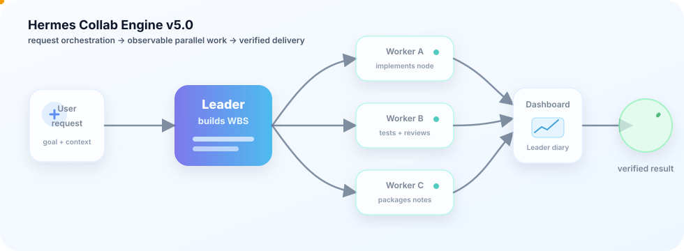

# Hermes Collab Engine v7.5

**多智能体协同引擎** — Leader 拆解 WBS → Worker 并行执行 → LLM 审查聚合。

[](README.en.md) [](CHANGELOG.md) [](sandbox/README.md) [](#许可证) [](SECURITY.md)

多智能体编排引擎，支持 WBS 协同、并行 Worker、Skill/MCP 分发、Lessons 自学习。

> 📖 **[操作手册](docs/manual/)** · [`ROADMAP.md`](ROADMAP.md) · [`CHANGELOG.md`](CHANGELOG.md)




## 发布与社区

如果这个项目对你有帮助，欢迎 star 关注。参与前请阅读 [`CONTRIBUTING.md`](CONTRIBUTING.md)，安全问题请走 [`SECURITY.md`](SECURITY.md)，路线图见 [`ROADMAP.md`](ROADMAP.md)，版本变化见 [`CHANGELOG.md`](CHANGELOG.md)。

## 一行部署

```bash
curl -fsSL https://raw.githubusercontent.com/lpc0387/hermes-collab-engine/main/scripts/install.sh | bash
```

安装后：

The install script also seeds leader role discipline skill and memory into your Hermes config, ensuring proper engine usage patterns.

```bash
opc                  # 交互式配置并启动
hermes-collab run "分析项目结构" --cwd .   # 直接运行任务
hermes-collab server --host 0.0.0.0 --port 8765  # 启动 Web 面板
```

## 快速开始

```bash
pip install -e .
hermes-collab run "分析 src/ 结构" --cwd . --json
hermes-collab server --host 0.0.0.0 --port 8765 --cwd .
```

## 亮点

| 能力 | 说明 |
|---|---|
| WBS 协同 | Leader 评分、拆解、分发节点，Worker 按依赖并行执行 |
| 双模型 | Leader / Worker 可选用不同模型 |
| **Leader 审查报告** | 节点执行完成后，LLM 逐项对照任务要求审查产出，生成结构化审查报告持久化到 DB，📓 按钮查看 |
| **多 Agent 支持** | opencode / claude-code / codex / hermes 四种 Worker 全链路支持，各带 session 持久化能力 |
| **Codex 两段式 dispatch** | codex exec 不写文件限制的解决方案：先生成代码→提取→写入→执行，三段式流水线 |
| SkillDistributor | 集中分发引擎，节点能力自动匹配 skill + MCP 工具 |
| MCP 工具集成 | 搜索 / 浏览器 / UI 组件等 6 个服务器 |
| 协议代理 | Go/Python 内置代理，自动翻译 Anthropic ↔ OpenAI |
| Lessons 自学习 | 引擎自动记录经验并去重提炼 |
| 运行中干预 | kill/split/skip/redo 节点 |
| **Agent 健康检测** | 自动检测可用 Agent，不可用时自动 fallback 到 opencode |
| **线程安全加固** | agent_backend 局部分配、SSE 连接加锁、_worker_sessions 遍历加锁 |
| 会话链 | 接入上次会话形成连续链 |
| 隔离沙盒 | 一键启动，独立 DB/workspace，TTL 自动清理 |
| Level 4 Jail | Worker 子进程 mount/PID/user 隔离 |

## 架构

```
用户 → Leader (WBS 拆解) → Worker × N 并行 → 聚合 → 结果
```

| 层 | 技术 |
|----|------|
| 引擎 | Python 标准库（零第三方依赖） |
| Worker | opencode / claude-code / 自定义 |
| 面板 | 单 HTML 文件 (Alpine.js) |
| 数据库 | SQLite |
| 协议代理 | Go (默认) / Python (备用) |

## v3 Architecture Highlights

v3 engine refactoring focuses on stability, observability, and session continuity. The public subset of the v3 features has been ported to Hermes Collab Engine.

| Feature | Description | Key Files |
|---------|-------------|-----------|
| **Leader Persistent Session** | Leader session persistence for long-running tasks with checkpoint recovery | `leader/session.py` |
| **Direct Mode Optimization** | Optimized direct execution path bypassing unnecessary overhead | `engine/direct.py` |
| **Node State Tracking** | Granular task node state machine (pending/running/done/failed/skipped) | `engine/node_state.py` |
| **Session Chain** | Cross-session linking for continuous conversational context | `engine/session_chain.py` |
| **Context Truncation** | Intelligent context window management to avoid token overflow | `engine/context_truncation.py` |
| **AgentSession** | Persistent session interface for agent backends (create_session / session_send / close_session); implemented by opencode and hermes agents for multi-turn context retention | `engine/agents.py` |

> **Benefits:** Resumable tasks, transparent execution status, continuous multi-turn context, and reduced token waste.

## CLI 快速参考

```bash
hermes-collab run "<task>" --cwd .          # 运行任务
hermes-collab run --request-file task.md    # 文件提交
hermes-collab server                        # 启动面板
hermes-collab lessons                       # 查看经验
hermes-collab skills/tools/agents           # 查看注册表
hermes-collab kill/split/skip/redo          # 运行中干预
```

> 完整 CLI 参考见 [`docs/manual/cli.md`](docs/manual/cli.md)

## API

| 方法 | 路径 | 说明 |
|---|---|---|
| GET | `/api/overview` | 总览数据 |
| GET | `/api/runs` | 运行记录 |
| GET | `/api/runs/:id` | 运行详情 |
| GET | `/api/logs` | 最近日志 |
| GET | `/api/lessons` | 自学习经验 |
| GET | `/api/agents` | Agent Backend |
| GET | `/api/skills` | Skill 注册表 |
| GET | `/api/tools` | Tool 配置 |
| POST | `/api/runs` | 提交任务 |
| SSE | `/api/events` | 实时事件流 |

> 完整 API 文档见 [`docs/manual/api.md`](docs/manual/api.md)

## 联系与支持

WeChat: `lg19961117`

<details>
<summary>可选赞助支持维护</summary>


</details>

---

**License:** MIT · 多智能体 · AI编排 · WBS · Agentic AI

> **GitHub Topics 推荐:** `multi-agent`, `claude-code`, `ai-orchestration`, `wbs`, `llm`, `agentic-ai`
